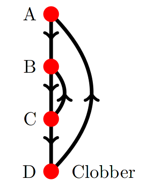
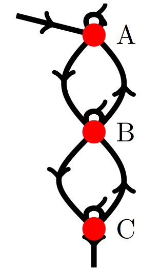
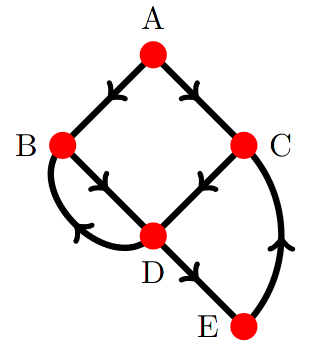

This document is an explanation of what the LiveDebugValues (LDV) pass does,
both the "old" variable location based one, and the "new" value tracking one.
The reader is expected to be fairly familiar with LLVM debug-info primitives.
The intention here is to explain:
 * At a high level, what LiveDebugValues is doing
 * How it is that the location-tracking LiveDebugValues does that 
 * How value tracking LDV differs
 * A semi-detailed explanation of how value tracking LDV is implemented

Motivation: While I'm confident that value tracking LDV is an improvement, it's
also a massive lump of C++ that other people in the community will be forced to
deal with, and I don't want to spring it on people without them knowing how it
works. Explaining what's going on also reduces the bus factor.

In some review comments ~years ago, Adrian mentioned he didn't really want LDV
becoming the "everything debug-info" pass. Awkwardly, this does move in that
direction (although it's limited to variable location stuff).

Other important background reading: a similar GCC proposal from many years ago
to track variable values rather than locations:

   https://gcc.gnu.org/wiki/Var_Tracking_Assignments

# What even /is/ LiveDebugValues

Throughout the process of compilation, LLVM tracks two pieces of information
about variable locations:
 * The value (or location) of the variable,
 * The position in the instruction stream where the value (or location) becomes
   the variables value.

The output of compilation, however, is in general a DWARF location list that
maps every instruction in a function to a location, or no location, representing
that the variable is optimised out at the position of that instruciton.

The LiveDebugValues pass translates the former into the latter: intrinsics
recording values/locations must become this per-instruction mapping. The
main difficulty in the process is that control flow in the function and movement
in data values between registers makes the location challenging to track.
Section 1.6.2 of [XXX cite carolines thesis] describes many of the difficulties
from a whole-compiler view. To LDV, the main components of the problem are:
 * Tracking the potentially multiple registers and stack slots a value might
   be located in
 * Tracking all the scenarios that may invalidate a value, leading to a change
   in location, or potentially the value no longer being resident in the machine
 * Coping with control flow merges, where multiple variable values may join
   together in what's effectively a PHI operation.

Of these, the latter is the source of the most pain -- LLVM does not track PHIs
after regalloc meaning we must piece back together what values merge together at
a control flow join, and what values remain unchanged. Control flow merges where
we cannot guarantee that the ``current'' variable value is in the same location
on each incoming edge, means the variable location must be discarded.

As well as keeping track of variable values as they are used by the compiler,
LiveDebugValues must keep track of variable values when they are resident, but
no longer live. A particular annoyance for developers is being able to see a
variable value in a register, but the compiler not presenting that register as
the variables location.

Peak diffficulty comes with nested loops that are not necessarily well formed,
where a variable value is preserved and resident across some of the inner loops
but not all of the outer loops. This requires LDV to identify which of the loops
has the variables value resident throughout the loop, including across the loop
heads, as well as identifying those loops where it is not.

Finally, note that LDV produces variable locations purely based on where the
debugging intrinsics are placed -- line numbers are not considered at all,
although sometimes we drop variable locations when we know variables have gone
out of scope.

# How does variable location tracking LDV do its stuff?

Lattices.

Assume first that within a block it is easy to identifying the movements of
values between register locations. The amount of static analysis of machine
instructions required may be complex, but there are few(er) algorithmic
challenges with single blocks of sequential code.

Ignore for a moment that the location of a variable value can vary. Instead,
reduce each block to a boolean value of whether its location is known at the
end of the the block. Now consider this to be a transfer function, and apply an
optimistic dataflow algorithm. Briefly, this assumes the variable location is
available (``true'') on entry to each block, and then iteratively marks the
location as unavailable (``false'') if it can't be proved the location is
always known in its predecessors. This produces a very simple lattice:

    True
      |
      |
      v
    False

Subsequently, we can use block-local static analysis to identify when a
particular value is not longer resident in the machine, and also identify find
blocks where incoming variable locations from predecessors differ. Either of
these scenarios is an additional reason to move the lattice value from True to
False in block live-outs and live-ins respectively.

The result of this analysis is a set of blocks with live-in value True,
indicating that the variable location on entry to the block is the same as all
its predecessors. This accurately resolves all questions regarding how variable
locations are affected by control flow. A final static analysis of each block
translates this information and any internal DBG_VALUE instructions into a
sequence of DBG_VALUEs identifying each point in the block where a variable
takes on a particular location. This is used by DbgEntityHistoryCalculator to
produce a location list, later.

## Limitations

This implementation of LiveDebugValues is (relatively) easy to understand and
produces an accurate mapping. As it only tracks locations rather than values,
it isn't suitable to deal with the instruction-referencing work. It's also not
able to deal with scenarios where variables legitimately have multiple
locations. For example: where a variable is located in a stack spill slot
throughout a loop, but is loaded into a register during the course of of the
loop. LiveDebugValues isn't able to determine which is the "better" location,
follows the load, and at the loop head determines that the variable has
differing locations (stack vs register). This leads to the variable location
being dropped, despite a location being knowable throughout the loop.

# Value tracking LiveDebugValues

One of the goals of the instruction-referencing work is to track variables by
their value rather than location. As a result, the definition of a value is
dealt with separately from the matter of where intrinsics indicate variables
take on a particular value. This leads to two problems to solve, which are now
described from a high-ish level. 

Both of these problems are effectively analysing the compile function to put it
back into SSA form, with some additional quirks. Consider: the "defs" are the
instructions that define a variable value, while the "uses" are debugging
intrinsics specifying what a variables value is. PHIs are implicitly present
where control flow merges.  We have to reconstruct SSA and determine where to
place PHIs in the context of a machine with a finite number of locations, some
of which have their values clobbered or duplicated. The two problems are then:
 * The "machine value location" problem: for a fixed set of registers and stack
   slots, and an instruction that that define a value into one of them, which
   locations is that value in through the rest of the function?
 * Given the solution to the "machine value problem" for all variable values,
   and the collection of debugging intrinsics defining where a variable takes
   a value: what location should the variable have for each instruction in the
   function? This is the "variable value problem".

To show that we can consider this an SSA problem, consider the following MIR:

    entry:
      $rcx = MOV64ri 1
      JMP %bb.1

    bb.1:
      CMP32ri8 $rax, 1
      JL %bb.5.exit

    bb.2:
      CMP32ri8 $rbx, 1
      JL %bb.4

    bb.3:
      $rbx = LSHR $rbx, 1
      JMP %bb.2

    bb.4:
      $rax = LSHR $rax, 1
      JMP %bb.1

    bb.5.exit:
      RETQ

Here we have two loops that nest, looping over the values of $rax and $rbx,
shifting the registers within the loops. To better understand how SSA will
help us solve variable-location problems, we can write the same function in
C:

    void foo(int arg1, int arg2) {
      int rax = arg1;
      int rbx = arg2;
      int rcx = 1;
      while (rax >= 1) {
        while (rbx >= 1) {
          rbx >>= 1;
        }
        rax >>= 1;
      }
    }

Compile it with clang, and run -mem2reg -simplifycfg over it:

    define dso_local void @foo(i32 %arg1, i32 %arg2) {
    entry:
      br label %while.cond

    while.cond:
      %rax.0 = phi i32 [ %arg1, %entry ], [ %shr4, %while.end ]
      %rbx.0 = phi i32 [ %arg2, %entry ], [ %rbx.1, %while.end ]
      %cmp = icmp slt i32 %rax.0, 1
      br i1 %cmp, label %while.cond1, label %while.end5

    while.cond1:
      %rbx.1 = phi i32 [ %shr, %while.body3 ], [ %rbx.0, %while.cond ]
      %cmp2 = icmp slt i32 %rbx.1, 1
      br i1 %cmp2, label %while.body3, label %while.end

    while.body3:
      %shr = ashr i32 %rbx.1, 1
      br label %while.cond1, !llvm.loop !2

    while.end:
      %shr4 = ashr i32 %rax.0, 1
      br label %while.cond, !llvm.loop !4

    while.end5:
      ret void
    }

Compare the LLVM-IR SSA form of this program with the MIR form: each computed
value is distinct, and SSA can determine the correct value for any Use at any
point in the program. We could identify Values in the LLVM-IR program above
and link them to debug instruction-numbers or DBG_PHIs, to identify a set of
Defs, then consider all instructions dominated by a DBG_INSTR_REF as a Use.
This gives us a large part of what we need, a mapping from each instruction to
a variable location.

Unfortunately, just using SSA isn't a perfect solution. We may be able to
determine the correct value for each instruction, but that value may not be
_resident_ in the machine at that instructions position -- for example, the
value may have been clobbered.

It may be the case that an instruction isn't dominated by one DBG_INSTR_REF.
If so, SSA can determine where a PHI instruction should occur to merge
preceeding variable values... however such a PHI value may not be resident,
or ever computed, by a function. For example:

    bb.1:
      $rax = MOV64ri 0, debug-instr-number 1
      DBG_INSTR_REF 1, 0
      JMP %3

    bb.2:
      $rbx = MOV64ri 1, debug-instr-number 2
      DBG_INSTR_REF 2, 0
      JMP %3

    bb.3:
      NOOP

At the NOOP instruction, we can determine that the variables value should be
a PHI between the first MOV64ri and the second MOV64ri. However, as they are
in different registers on entry to bb.3, this PHI is never computed.

Finally, as well as having PHI values that are never computed, SSA is also able
to create PHI values that are actually no-ops. Consider the following C:

    int ext();

    int foo(int bar) {
      int a = bar;
      int b = 0;
      if (ext()) {
        b = bar;
      } else {
        b = a;
      }
      return b;
    }

The value of 'b' is always the value of 'bar' on the return statement, however
mem2reg is not immediately able to determine this and places a PHI in the
exit block. Were we to do this in LiveDebugValues, we would specify that a
variable has a PHI value that is never produced. mem2reg solves this by seeking
out no-op PHIs and propagating them:

https://github.com/llvm/llvm-project/blob/a6d2a8d6f59a974752666305c4baaabebee41b95/llvm/lib/Transforms/Utils/PromoteMemoryToRegister.cpp#L686

These are all challenges faced by LiveDebugValues in producing SSA-like
information for variable values. Rather than exactly replicating what mem2reg
does and focusing on individual locations, I've pursued a per-block approach
that translates each block into a transfer function, then propagates live-in
and live-out information between blocks. This allows us to behave largely the
same as the dataflow analysis in var-loc based LiveDebugValues -- however,
it is strictly not a dataflow analysis because:
 * Each block has some non-lattice memory associated with it,
 * Technically we don't "meet" lattice values together
all elaborated below.

Instead of examining all PHI nodes to identify dead PHIs as mem2reg does, I:
 * Use value propagation between blocks to avoid creating un-necessary PHIs
   in the first place, for sequential code,
 * Iterate over loop heads to identify and eliminate dead PHIs, in roughly
   the same way that mem2reg does

Is it right to be using SSA this late in compilation? I would say yes -- after
all, the program is in SSA-form right up to register allocation, and we only
leave SSA form because machines have a finite number of registers available.
After regalloc, there's still an SSA program present, but it's encoded into a
limited set of locations.

Before delving into the two different value-tracking problems, we'll first
explain the loop-head-dead-PHi algorithm, as it's shared between each value
tracking problem. First, assume we have a function in SSA form, much like
LLVM-IR, but where a potentially dead PHI has been placed at each loop head,
identified by having a back-edge under reverse-post-order.

Intuitively: we explore loop heads in RPO, and determine whether the PHI at
a loop head is dead by assuming it is dead and propagating the common incoming
values on non-backedges through the function. If that value returns on the
backedges, the PHI is dead, otherwise it is still needed. We then move on to
the next loop head in RPO.

Unfortunately, whether a loop head PHI is dead can depend on behaviours that
are not exposed in a single pass through the function. Thus, we rely on
performing a dataflow-like analysis using live-in and live-out values, with
additional information stored at loop heads. That information is a single
ValueIDNum.  The fact that we store non-lattice information about loop-head
blocks and rely on RPO for correctness makes it not dataflow; but it's roughly
the same.

Intuitively: the ordering of loop heads forms a sequence of Boolean choices,
"Does this loop create a PHI or not?", which the algorithm explores. For any
sequence prefix, once the true assignment of choices is found, it is not
modified further and exploration only continues in the remainder of the
sequence. This makes the true prefix of assignments found increase
monotonically. Whenever we change a loop-head from being assumed to being
live-through to creating a PHI, we reset all our assumptions about subsequent
loop heads in the sequence: this is detected with the stored loop head value.
Here's some pseudocode to illustrate:

    conflict = TRUE if non-backedge predecessors have different incoming values else FALSE
    backedge-conflict = NOT conflict AND backedge predecessors have a different value to non-backedge predecessors,
    new-predecessor-value = TRUE if VALUE != common non-backedge predecessor value else FALSE
    IF conflict:
      - Produce a PHI value at this block
    ELIF backedges not explored yet:
      - Emit common predecessor value as live-through
    ELIF backedge-conflict
      IF new-predecessor-value
        Emit common predecessor value as live-through
      ELSE
        Produce a PHI value at this block
    ELSE (i.e., all incoming edges agree on a value)
      Emit common predecessor value as live-through
    set VALUE = the common predecessor value, or PHI from this block if there
                was none.

We start exploration by assuming that all PHIs are dead and propagating the
non-backege predecessor values through the function. Subsequently, in RPO,
we identify true-PHIs by the fact their incoming values conflict. Crucially:
when we add a true-PHI, all blocks later in the RPO sequence recognise this
because they stored the value they previous propagated. Later loop heads
will propagate this new value: they will only produce a PHI at a loop head when
there is still a conflicting backedge after we've propagated values around
the loop at least once.

More formally, we'll use a lemma-ish: Once a loop head A switches to producing
a PHI value, no later block in RPO can make A switch back to being live-through
on a backedge to A. To do so, the value common to A's other incoming edges
would need to be propagated and returned on such a backedge to A. Before
emitting a PHI at A, we have already explored all later blocks and assumed that
all loop heads do not produce PHIs. This was not sufficient to prove that the
value entering A is live-through, and exploration of later blocks will only
introduce new PHI values that cannot dominate A.

Not covered by the paragraph above is that a later block could produce a PHI
value that affects a backedge to a block dominating A, causing a dominating
loop head to switch from live-through to creating a PHI. However, the lemma-ish
applies to that dominating loop head too. We can demonstrate completion by
recursion: for the first loop head, the function is explored until the loop
heads true value is found (and subsequently never changes), after which we
move on to the second loop head, and so forth.

To demonstrate we create all necessary PHIs and no dead PHIs: PHI creation
occurs iff we have a constructive proof that a value at a loop head cannot
be live-through, and we only complete once we have a constructive proof that
all remaining live-through loop heads are truly live-through.

Here are a few worked examples.

include here: NestedLoop.tikz
  

Assume that we enter this function at node "A", exit at "D", have a single
variable in the function which is clobbered in "D". The RPO exploration order
is A-B-C-D. Following the logic from the pseudocode: on the first pass through
the function, the initial, live-in-to-A value will be propagated to the live-in
values of all blocks -- and the live-in-to-A value will be stored in the loop
head value fields (for blocks A and B). On our second trip around the loop,
at loop heaad A, we determine that there is a backedge conflict, because the
value definition in block D is incoming on the backedge. The non-backedge
incoming value is still live-in-to-A, and the loop-head stored value is
live-in-to-A. The pseudocode determines that we must create a PHI value, which
we'll call PHI-A, and it's placed in the block live-outs and loop-head stored
value.

When considering block B on the second iteration, there is another backedge
conflict: the incoming value on the A-B edge is now PHI-A, but the incoming
backedge C-B value is live-in-to-A. However, the loop-head stored value is
live-in-to-A: following the pseudocode, we determine that a predecessor PHI
value has changed, so we propagate the new, incoming non-backedge value, PHI-A
to live-outs, and save PHI-A to the loop-head stored value.

Subsequently PHI-A is propagated as normal to nodes C and D. When we come back
around the function for a third time: the same procedure as above determines
that block A should produce PHI-A, at node B both incoming edges have value
PHI-A. None of the blocks change any live-out value in the iteration, and
we terminate.

Sample 2:

Include here: BadlyBehavedLoops
  

Here we have a number of loops between three blocks; entering at A and exiting
at C. The RPO exploration order is A-B-C. A single value, live-in-to-A enters
block A, and there is a definition in block C. In these blocks, each should
be given a true PHI value. The procedure for the first sample is repeated,
using the loop-head stored value to determine whether a backedge conflict
should lead to the creation of a PHI, or whether a new dominating value should
be propagated.

The important observation for this sample is that it takes three passes through
the function, in RPO, for the definition in block C to be propagated to the
B-A backedge, and thus cause a PHI to be created in block A:
 * In the first pass, we propagate live-in-to-A through all blocks
 * In the second pass, we determine that a PHI should be created at block B,
   as the C-B backedge has a conflicting value,
 * In the third pass the PHI in block B is propagated on the B-A backedge, and
   causes a PHI to be created in block A.

Sample three:

Include here: NonDomLoop
  

In this sample, assume we enter at block A with value live-in-at-A, exit
from block D, and have a value definition in block E. Note that there are two
loop heads in this example, and they do not dominate each other. Imagine if
we had exploration order A-B-C-D-E, where we could also have order A-C-B-D-E.
Again, in this example, it takes several iterations for the definition in
block E to reach block B -- it first forces a PHI in block C which is propagated
to block D, after which it must return on the D-B backedge to force a PHI in
block B. 

Summary: we're effectively recomputing SSA-form at the end of compilation, and
face the usual SSA problems such as eliminating dead PHIs. In the last section
of this document are implementation details for each flavour (machine location,
variable value) of problema, and some commentry on "Other issues" encountered.

# Implementation

I will begin with the caveat that this design has grown organically, and is
probably ripe for refactoring. We'll first cover some of the mechanistic
classes that InstrRef uses, then move on to how it solves the two different
problems using those classes.

## Values

Rather than constructing an object to identify each value computed in a
function, we instead uniquely number them. We consider each register definition
in the function to be a new unique value, including register mask clobbers,
and any PHI values on block entry. No attempt is made to coalesce or merge
identical values -- each values is characterised by the location it is defined
in and the position of that instruction. The ValueIDNum structure is a wrapper
around a uint64_t, with bitfields identifying:
 * The block number in which the value is defined,
 * The instruction number within the block, i.e., how many instructions from the
   beginning of the block the def occurs at
 * A number identifying the machine location (i.e. register) the def occurs in,
   known as a LocIdx, see below.

PHI values are considered to be values defined at the very beginning of a
block -- their instruction number is zero. Argument values are technically not
PHIs, but are given block number zero, instruction number zero.

This leaves the definition of location numbers. We could use the plain register
number, however there can be hundreds or thousands of them for some
architectures. With many unused (for example: CR3 or DR0 on X86) this would be
an un-necessary performance burden to track. Additionally, stack slots qualify
as a machine location that can store a value, and need to be represented. To
account for this, the specific location is abstracted by a LocIdx integer: each
LocIdx corresponds to a unique location (register or stack), and LocIdxes are
numbered from one upwards. We can then refer to a location in an abstract
manner, and only defined LocIdx to location mappings for those locations that
we actually use. Whenever an un-tracked location is found, we add a new LocIdx
for it.

## Trackers

InstrRef LiveDebugValues does its best to summarise blocks and avoids dealing
with per-instruction data as much as possible -- however we still need to
deal with instruction specific information within blocks themselves. To this
end, we have three kinds of "Trackers": objects to track the current ValueIDNum
in different registers / locations within a block, to track the current values
of variables within a block, and to track the transitions between locations
that varaible values make (from which we can produce DWARF location lists).

### MLocTracker

This class stores a table of LocIdx to ValueIDNum -- i.e., a mapping between
the locations and the values that they hold. It's used to identify the current
contents of locations when stepping through a block. It also contains the
mapping between LocIdxes and their corresponding machine registers or stack
slots. There are various methods for writing / reading to the set of tracked
values -- InstrRefBasedLDV calls these as it interprets instructions within
a block.

### VLocTracker

A map of DebugVariable to ValueIDNum -- nothing else to it!

### TransferTracker

This class is used to resolve variable values to specific variable locations:
it maintains a variable-to-location and location-to-variable map. When a
variable takes on a new value, it picks a location for it, and when a location
that contains a variable value is clobbered, it searches for a replacement
location that contains the same value. This class is the sharp edge of the
benefits that InstrRef LiveDebugValues provides: we can cope with variable
values that exist in multiple locations. Additionally, we can track debug
"use-before-def" scenarios, where a variable value has no location on entry
to the block but is defined inside that block.

The output of TransferTracker is a collection of program positions, and the
changes in variable location that occur at that position. These eventually
become DBG_VALUE instructions, that then go on to later form a DWARF location
list.

## Solving the machine location problem

To remember: this problem is about identifying the value in each location in
the function, at every program position, producing PHI values as we go.

To begin, we use produceMLocTransferFunction to summarise each block into a
location transfer function. This maps input location into output location.
We then produce explicit live-in / live-out tables -- genuine tables, in that
they're allocated with operator new[] -- set the live-in values for the entry
block to be argument values, then begin an analysis much like dataflow.

We explore the function in reverse-post-order, propagating values from block
live-ins to live-outs using the transfer functions. At control flow merges,
if the merge is a loop head we follow the PHI elimination algorithm described
in the previous section; otherwise, if the incoming values are identical we
propagate it to the blocks live-ins, or set the live-in to a PHI value at this
block if the values are not the same. This is all performed in the mlocDataflow
function, using mlocJoin to merge values at control flow joint. mlocDataflow
iterates over all blocks in RPO using a worklist, re-examining blocks where an
immediate predecessor has changed its live-outs, or where the live-in value
was "over-ridden" by the loop-head algorithm, i.e. any circumstance where we
alter the saved loop-head value. This ensures that blocks are always re-visited
in any scenario where their inputs change: unlike dataflow, we cannot safely
re-visit arbitary blocks as it may cause the loop-head algorithm to prematurely
produce a PHI value.

mlocDataflow terminates when there are no longer any blocks to revisit. The
output of the procedure is the set of live-in values, i.e., the map of location
to ValueIDNum on entry to each block in the program. Using this, and its
placement of PHI values, we can accurately determine the ValueIDNum at any
instruction in the program with only a small additional amount of work.

In terms of performance, unlike VarLocBasedLDV, we do not interpret every
instruction in the program every time we examine a block. On the other hand,
we maintain information for every single location within the function instead
of only those that form variable locations. Given that one of the compilers
objectives is to limit the size of the working set throughout the function,
the number of locations tracked should not be excessive, and as we do not
consider variable metadata at this stage, the main component of execution time
is probably the size of the function more than anythign else.

One gotcha exists: we try to limit the number of registers tracked to only those
necessary, but register masks clobber "all" registers, effectively defining
them. A small amount of juggling occurs to track blocks where register masks
occur, so that if a register becomes tracked /after/ a register mask is used,
we can install the correct value definitions in the right places.

## Solving the variable value problem

When first examining the function, we take any instructions that have
debug-instr-number annotations and record the ValueIDNums that they create.
After solving the machine location problem, we can then determine the value in
every location at all positions in the function. We step through all
instructions performing this analysis, to determine what ValueIDNums are read
by DBG_PHI and any DBG_VALUE instructions that appear in the function. Having
done this, we can record in VLocTracker every debug instruction that occurs and
its corresponding value, building a transfer function for variable values.

With this in mind, we could proceed in exactly the same manner as solving the
machine location problem, by perfomring a dataflow like analysis. However, there
is an extra problem. In the machine location problem there was always a single
candidate location where a PHI could occur... however for vairable values this
is not true: there could be multiple locations, as well as zero. Consider:

    bb.0:
      $rax = MOV64ri 0
      $rbx = COPY $rax
      $rcx = COPY $rax
      DBG_VALUE $rax
      JMP %bb.1

    bb.1:
      $rax = MOV64ri 1
      TEST $rdx, $rdx
      JCC %bb.1

Here, the live-outs of bb.0 contain three instances of the "MOV64ri 0"'s def,
in $rax $rbx $rcx respectively. On the loop backedge of bb.1, the value is
available in $rbx and $rcx still -- we must pick one of them. Consider
additionally:

    bb.0:
      $rax = MOV64ri 0
      DBG_VALUE $rax
      JMP %bb.2

    bb.1:
      $rbx = MOV64ri 1
      DBG_VALUE $rbx
      JMP %bb.2

    bb.2:
      NOOP 

We can easily determine that on entry to bb.2, the variable value should be a
PHI between the MOV64ri 0 value, and the MOV64ri 1 value. However, no such
PHI is resident in the machine, as the values are in different registers on
entry to bb.2.

These extra problems forces to us to store more information about variable
values than just the ValueIDNum -- we also store an enumeration indicating the
status of the variable value, in a class, DbgValue. There are four enum
elements:
 * Undef: a special placeholder in the variable-value transfer function
   indicating that the variable is unset. Not used as a variable value itself.
 * Def: This is a normal variable value
 * Const: The variable value is some form of constant, and not a value in a
   machine location (it's stored in a MachineOperand instead).
 * NoVal: This variable value could not be matched against a PHI value.

The machine location problem effectively only has "defs", while an Undef value
in a transfer function indicates the variable was subject to a DBG_VALUE $noreg.
A constant value indicates the value has an integer or floating point constant.
No attempt is made to merge these with non-identical variable values when
control flow merges, we just drop the variable value. Finally: NoVal indicates
that the variable is such a dropped value, where there was no appropriate
location for variable values to be merged.

XXX XXX XXX in reality we have a semi-spurious "Proposed" status in the
enumeration. In mlocs it seems to be avoided by allowing everything to
propagate to completion, no "dud" value required to be left hanging around.
Do we really need this dud value, or can we stomp on it?
XXX XXX XXX It's probably because there's something wrong with the revisiting
of block heads.

To resolve multiple candidates for PHI locations, at present we just pick one,
with very little thought as to which. It's possible that the wrong location
will be picked, leading to a variable location being (safely) dropped where
it might otherwise have been preserved. This is an acceptable limitation, and
extending the search is future work. We might also use information from
dbg.values of PHIs to try and determine the best PHI location, but again that's
future work.

Exploration of the variable value problem occurs in much the same way as the
machine location problem: we iterate over blocks in RPO, re-visiting if a blocks
immediate predecessors' live-outs change, and if the live-in value at a block
is "over-ridden" in the loop head algorithm. However, we apply an optimisation:
because we having source-locations for instructions, we can determine which
blocks a variables value is in scope for, and limit our exploration to those
blocks. For example, if a variable only exists inside a loop, instead of
tracking the variables value across the whole function, we instead only track
it inside the loop. The blocks over which the variable value problem iterates
are limited to only those in scope for the variable. Technically VarLocBasedLDV
does something similar by dropping variable locations when they go out of
scope, but we take this one step further by effectively doing no work for any
variable that is only in scope for one block. This significantly attenuates
the effect of deep inlining!

Rather than operating on a variable-by-variable basis, instead it's performed
scope by scope. The vlocDataflow method takes a lexical scope, identifies the
relevant blocks to explore, and then solves the variable location problem for
all the variables in scope. The output of the variable location problem is
a mapping of variables to live-in values on entry to each block.

## Putting it all together

With the solution to both problems, we can produce mappings of what variable
values should be at each instruction, and what values are in which locations.
The TransferTracker class is then able to step through each block and produce
a mapping for each variable from each instruction to a location, or no location
if none is available. These are eventually emitted as DBG_VALUE instructions.
While we rely on DbgEntityHistoryCalculator to produce location lists from
these DBG_VALUEs, in the future we could produce location lists immediately in
LiveDebugValues and save ourselves some memory.

## Other complications

In the shiny new world of instruction referencing, DBG_INSTR_REFs always refer
back to instructions labelled with debug-instr-number or possibly a DBG_PHI.
Unfortuantely there may be duplicate debug-instr-number instructions or
DBG_PHIs, because tail duplication can clone such instructions. This causes
what is in effect, another SSA problem! If we duplicate the tail block bb.3
here:

    bb.1:
      $rax = MOV64rm @something
      JMP %bb.3

    bb.2:
      $rax = MOV64rm @something_else
      JMP %bb.3

    bb.3:
      DBG_PHI $rax
      JMP_%bb.4

    bb.4:
      DBG_INSTR_REF
      NOOP

Then where we had a PHI value produced on entry to bb.3, and then read by the
following DBG_PHI, we instead have two DBG_PHIs of normal values in blocks 1
and 2, with a PHI occurring later in bb.4. We can consider this another SSA
problem, with the DBG_PHIs as def's, and the DBG_INSTR_REF as a use. This
scenario doesn't happen especially frequently, and so I've solved it by feeding
this information into LLVMs existing SSAUpdater utility: it identifies the
location of PHI values that should occur between the defs and use (which can
be verified with the machine location problem solved), and produces the value
number to be read by the DBG_INST_REF use.

While this particular problem is solved, there are further optimisations that
can happen to cloned debug instructions, for example in pre-regalloc tail
duplication. I haven't attempted to address them; they happen very infrequently.

# Fin

Thanks for listening to my TED talk, please open a beer and relax.
